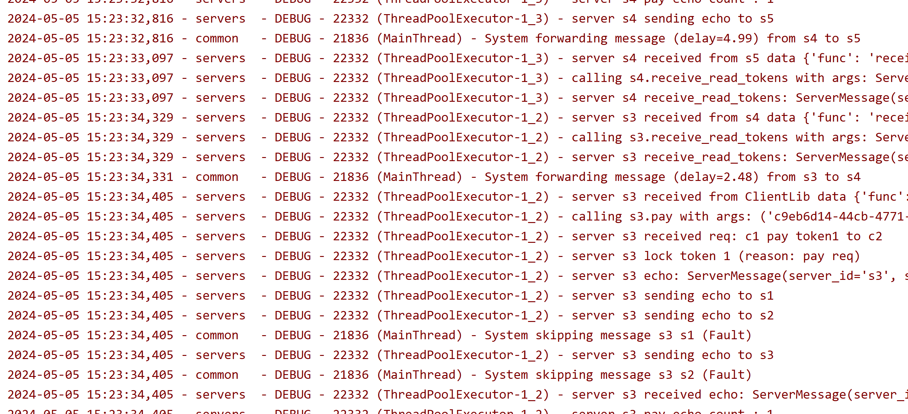

### Distributed System

quite a mess that works magnificently 

---

 

#### Simulated distributed network

Simulated distributed network with multiple servers and clients, and omission failures (f<n/2).
Servers sync state (with at least n-f, for safety) before replying to a client read/write request. \
Clients can transfer tokens they own to other clients (using the API that talks to the servers),
and can also query the servers for the current ownership state.